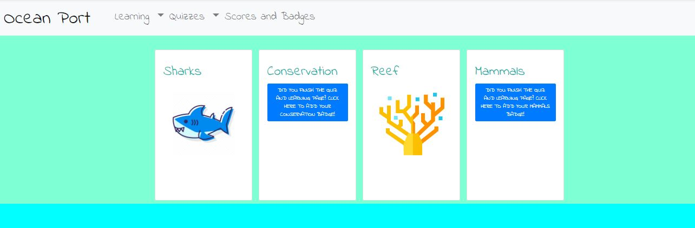

# OceanPort

Educational app that engages young audiences in learning about the ocean through videos, reading, and gamification.

- Open the link https://oceanport.herokuapp.com/ 
- Create an OceanPort account, and go to the learning tab. 
- Choose an ocean topic to read and learn about. 
- Then, take a quiz on that topic. 
- If you pass the test, you can give yourself a badge on the badges page. 
- If you log out, and log back in, your badges will still be saved. This lets you keep track of your progress and learning.

**Happy learning!**

### Team Roles
- Amanda Simonds - Frontend and Backend ReactJS, JSX, Passport.js Authentication, MySQL user information database
- Heather Carr - Frontend ReactJS, JSX Learning Pages
- Kalyan Gadda - Frontend ReactJS, JSX Quizzes
- Jordan Molinar - Frontend ReactJS, JSX Main Website Design
- Tyson Call - Frontend - Frontend ReactJS, JSX Main Website Design

### Technologies
ReactJS, Express, JSX, Passport.js, AJAX, MySQL, Sequelize, Heroku

### Process
- First, we set up the user authentication system using passport.js NPM package
- Designed a wireframe for the website flow
- Created database to save user information
- React.Context file developed to manage user state
- Developed Learning Pages and Quizzes
- Set up the Badge system
- Deployed to Heroku

### Future Development
- Interactive game
- Integrate with our sister app, SpacePort
- Badge is saved when the quiz is finished

**Welcome Page**  

  
  
**Sign Up or Log In**  

  
  
**Reef Learning Page**  

  
  
**Reef Quiz Page**  

  
  
**Badges Page**

